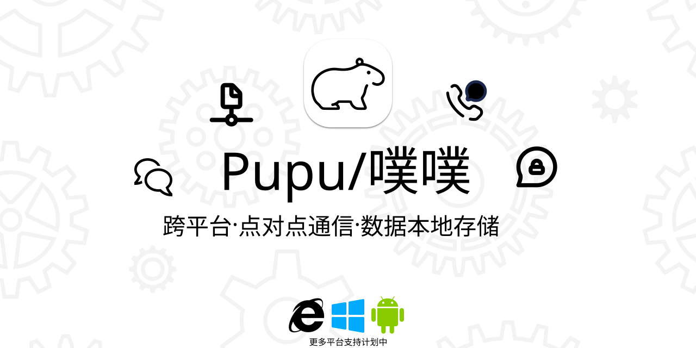
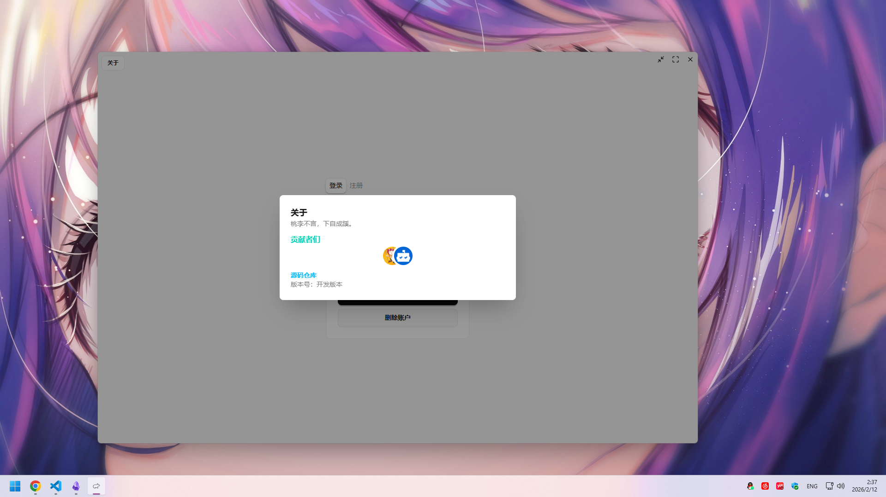
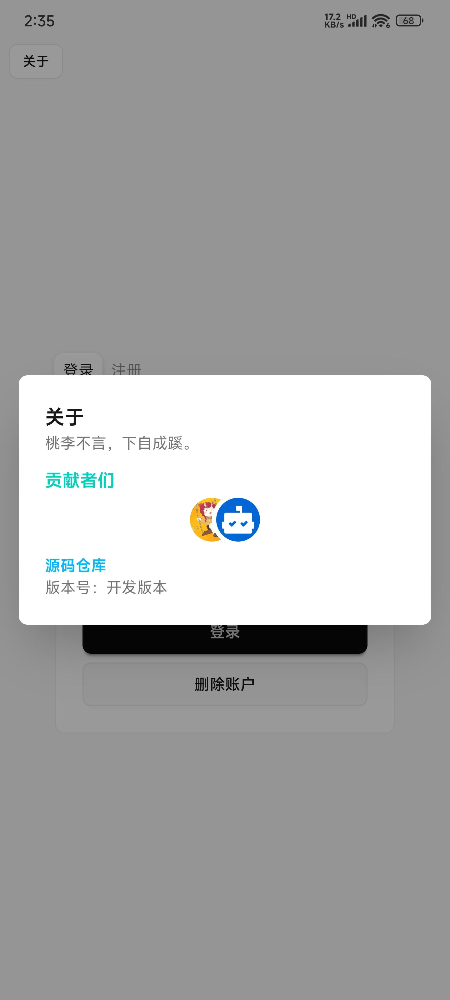
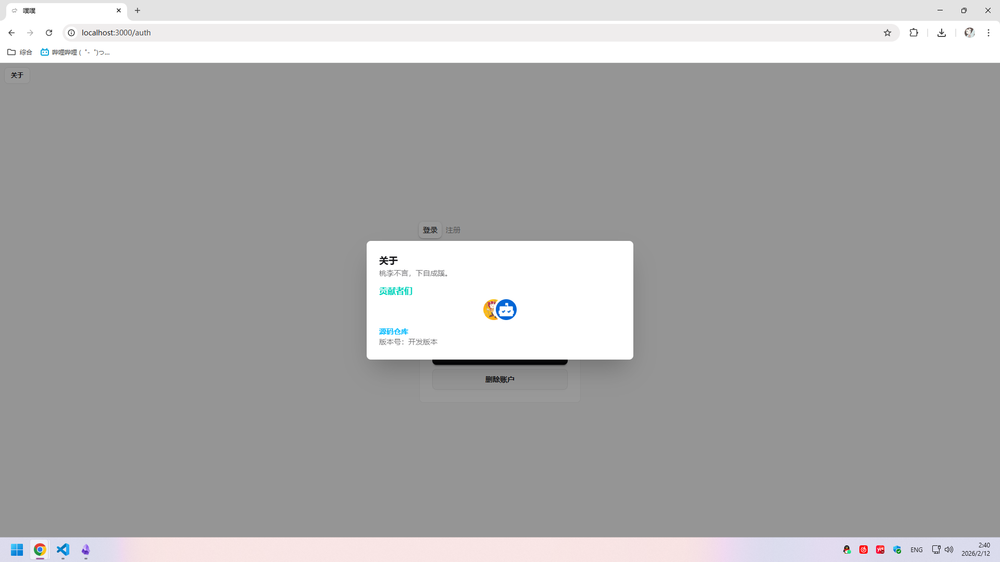
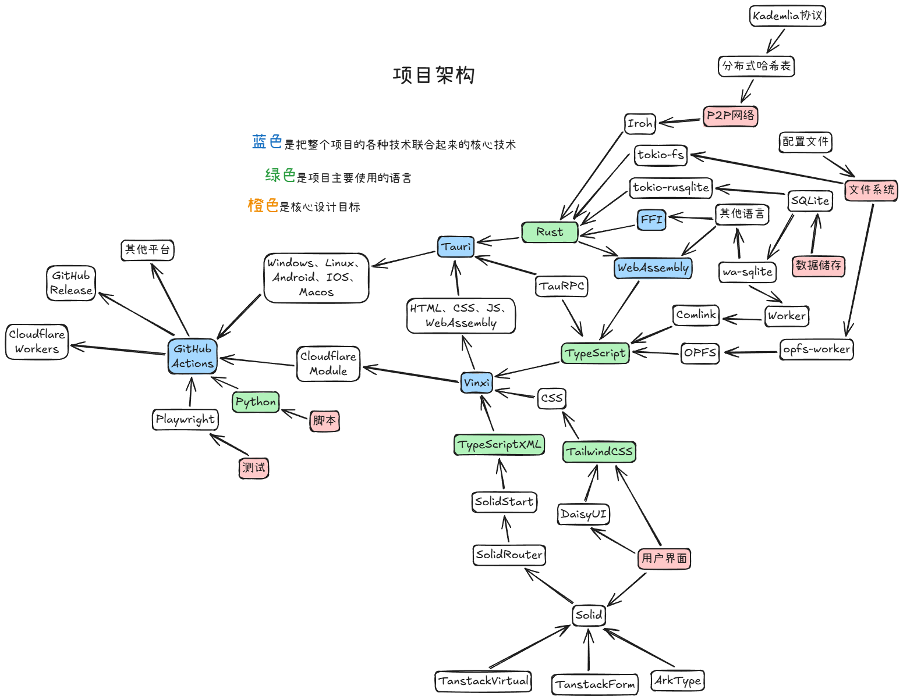

> _项目现在还在积极重构用户界面中_

  

    
    
    
  

  

    
    
    
  

  

    
    
    
  

## 📸 截图

| Windows                                  | Android                                  | Web                             |
| ---------------------------------------- | ---------------------------------------- | ------------------------------- |
|  |  |  |

## 💬 开发者的话

很久以前就想实现一个跨平台的P2P即时通讯软件，并且希望界面美观。现在借助Tauri框架，省去了跨平台适配的诸多麻烦，前端实现也让界面十分美观。未来只要Tauri支持的平台，我都计划支持。

这也是我的第一个开源项目，如果项目有不规范或者建议的地方也可以创建Issue告诉我。

## ✨ 功能特色

- 🔒 **隐私与安全**：软件完全开源，所有数据本地存储，不收集任何数据
- 🌐 **分布式P2P架构**：基于分布式点对点技术，用户连接无需特定服务器
- 🔐 **端到端加密**：所有通信数据端到端加密传输，保障通信安全

> _本项目仅提供开源软件，请遵守法律法规，**禁止用于违法用途**。_

## 📥 下载

- **[GitHub Release](https://github.com/zhangxichang/pupu/releases/latest)**
- **[Gitee Release](https://gitee.com/zhangxichang/pupu-release-latest/releases)**

## 🏗️ 项目架构

## 🤝 贡献指南

欢迎提交 Issue、PR 或文档改进，共同完善项目！

